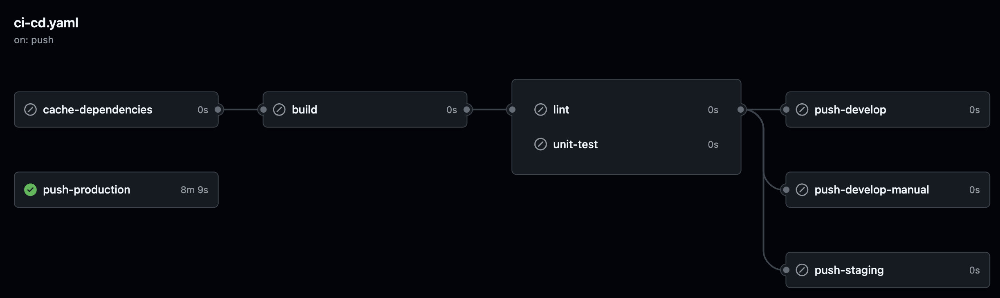

# CI/CD

The workflow consists of 4 stages: `cache-dependencies`, `build`, `test` and `build/push` docker image.

<strong>Pull request workflow</strong>
All branches pointing to main within a pull request can trigger a workflow where an authorized user in the end can deploy a docker image to the develop environment. This should give the manual opportunity to test the proposed changes in the pull request in a test environment (develop).

<strong>Pull request to main workflow pointing to develop environment with manual approval of authorized users.</strong>

<strong>Push main workflow</strong>
All pushes to the main branch will trigger the same flow as the pull request workflow, except in the end the deploy to the develop environment will happen automatically as every push to main should be mirrored immediately to the develop environment.

<strong>Pushes to main workflow pointing to develop environment that automatically deploy.</strong>

<strong>Staging workflow</strong>
All pushes to (incl. the creation of) a Release branch (`release/*`) will trigger the same flow as the other workflows, except pointing to the staging environment. It is important to note that naming the branch following the [Semanting Versioning](https://semver.org/lang/de/) specification is crucial as the version in the branch name of `release/*` will determine the tag name of the docker image that is being built and pushed. The build and push requires manual action by an authorized user.

<strong>Staging (Push & Create release branches) workflow pointing to staging environment with manual approval of authorized users.</strong>

<strong>Production workflow</strong>
All pushes to (incl. the creation of) a Tag (`tags/*`) will skip straight to the build and push stage. Following the same naming principle regarding Semanting Versioning, tag naming also determines the image tag of a docker image. Just as the staging workflow, the build and push requires manual action by an authorized user again.

<strong>Production (Push & Create tags) workflow pointing to production environment with manual approval of authorized users.</strong>